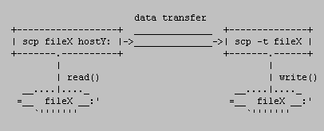

How the SCP protocol works
----
By janp on Jul 09, 2007

***This document is a copy of the article described at the following site: https://web.archive.org/web/20170215184048/https://blogs.oracle.com/janp/entry/how_the_scp_protocol_works***

Have you ever wondered how the scp and rcp commands worked? The first time I did I haven't found any documentation on the subject. There is no RFC, no draft, not even README file describing it. After reading the source code I tried again and realized that old version of rcp.c might be really the only original documentation available. And since I worked on a couple of bugs in our scp(1) some time ago I put a note in my todo list to write something about it, for the next time I'm going to need it.

### A very short history of the protocol
The rcp command appeared in 4.2BSD in 1982, with this manual page. Since then it evolved a little bit which means that old rcp can't work together with current rcp in all cases. The same protocol was used in ssh-1.2.x implementation which was later used as a base for OpenSSH. Since Solaris Secure Shell is a fork of OpenSSH it means that the very same protocol is used in scp(1) in Solaris. Having said all of that I should have probably named this blog entry How the RCP protocol works but it doesn't look cool, you know. If you have more information about the history of the protocol let me know please.

### How it works
I will talk only about scp. As already said, rcp is the same beast with regard to the protocol, it just uses rlogin as a mode of transportation. The synopsis for scp(1) is like this:

```
scp [options] [user@]host1:]file1 []... [ [user@]host2:]file2
```

In all cases aside from remote-to-remote scenario the scp command processes command line options and then starts an SSH connection to the remote host. Another scp command is run on the remote side through that connection in either source or sink mode. Source mode reads files and sends them over to the other side, sink mode accepts them. Source and sink modes are triggered using -f (from) and -t (to) options, respectively. These options are for internal usage only and aren't documented. There is also the 3rd hidden option, -d, when the target is expected to be a directory.

So, slightly simplified, the local to remote mode of scp works like this:


#### The protocol
So, how does the transfer protocol actually works? If you forget about ssh, sshd and the connection between them and concentrate only on interaction between scp in "normal" mode and scp in the sink mode, you can see the scenario like this (if you copied from remote to local the remote scp command would have been run with -f option instead of -t, denoting the source mode):



Another important thing is that scp processes with options -f and -t never run against each other. That means that one of those options is always used on the remote side and local scp process (the one started by the user from the command line) then simulates the other mode because it's also the process that interacts with the user.

##### The source mode
The protocol is a mixture of text and binary data that form protocol messages. For example, when the regular file is about to be sent (= source mode), the type of the message, mode, length and filename are provided in plain text, followed by a new line. The file data itself follows; more on this later. The message can look like this:

```
C0644 299 group
```

There might be more protocol text messages before the binary data transfer actually begins. The scp in source mode (= data producer) always waits for a reply before the next protocol line is sent. After the last protocol message was sent, the producer sends a zero byte to notify scp in sink mode about beginning of the actual data transfer. A confirmation zero byte is sent by the sink mode scp process after the last byte of a file was read on the other side.

##### The sink mode
Every message and every finished file data transfer from the provider must be confirmed by the scp process that runs in a sink mode (= data consumer). The consumer can reply in 3 different messages; binary 0 (OK), 1 (warning) or 2 (fatal error; will end the connection). Messages 1 and 2 can be followed by a text message to be printed on the other side, followed by a new line character. The new line character is mandatory whether the text is empty or not.

#### List of protocol messages
```
Cmmmm <length> <filename>
```
a single file copy, mmmmm is mode. Example: C0644 299 group

```
Dmmmm <length> <dirname>
```
start of recursive directory copy. Length is ignored but must be present. Example: D0755 0 docs

```
E
```
end of directory (D-E pairs can be nested; that's why we can copy recursively)

```
T<mtime> 0 <atime> 0
```
modification and access times when -p options is used (I guess you know why it doesn't make sense to transfer ctime). Times are in seconds, since 00:00:00 UTC, Jan. 1, 1970. Two zeroes are present there in case there is any need to use microseconds in the future. This message was not present in original rcp implementation. Example: T1183828267 0 1183828267 0

After the messages the raw data is transfered. The consumer reads exactly that much data as specified in the length field. `D` and `T` message must be specified before any other messages. This is because otherwise it couldn't be clear whether those lines are part of the protocol or part of the data transfer. From the way how the protocol works we can induce that:

after `C` message the data is expected (unless the file is empty)
after `D` message either `C` or `E` is expected. This means that it's correct to copy an empty directory providing that user used -r option.

##### Maximum file size and file integrity protection

Maximum file size depends on the SCP software and the systems (and filesystems) where the software is used on. Given the fact that the file size is transferred as text the only limitation may happen in the server or the client. OpenSSH (so SunSSH as well) uses long long int type to process the file size. This type must be able to hold at least 2\^63. That's a huge number since 2\^40 is 1000GB (a thousand GB), for example. This means that practically there is no file size limit in OpenSSH as such. Do not forget that on FAT32, for example, you can not have a file greater than 4GB.

Strong integrity protection is provided by the underlying SSH protocol. Some of that has been discussed in my blog entry on some SSH error messages, full specification of the protocol can be found in RFC 43253, The Secure Shell (SSH) Transport Layer Protocol.

#### Examples
Now it's time to have some fun. The protocol description might not be that describing like a few simple examples.

**1. Single file copy to the remote side**

Let's have a file test, containing string "hello" and we want to copy it over SCP protocol to /tmp directory.

```
$ rm -f /tmp/test
$ { echo C0644 6 test; printf "hello\\n"; } | scp -t /tmp
test                 100% |\*\*\*\*\*\*\*\*\*\*\*\*\*\*\*\*\*\*\*\*\*\*\*\*\*\*\*| 6       00:00    
$ cat /tmp/test
hello
```

Nice, isn't it? I used printf so that it's clear why we used 6 for the file length. Now something with a directory copy.

**2. Recursive directory copy to the remote side**

Let's have the file test in a directory testdir. Now we want to recursively copy the whole directory to /tmp on the "other side".

```
$ rm -rf /tmp/testdir
$ { echo D0755 0 testdir; echo C0644 6 test;
    printf "hello\\n"; echo E; } | scp -rt /tmp
test                 100% |\*\*\*\*\*\*\*\*\*\*\*\*\*\*\*\*\*\*\*\*\*\*\*\*\*\*\*\*| 6       00:00    
$ cat /tmp/testdir/test
hello

```
Note that we had to use -r option because the directory copy was involved.

**3. Copy the directory from the remote side**

Now the scp program in the pipe will represent the remote side, the producer of the data. As said in the protocol section, the consumer (we) must reply to every protocol message and also to the finished data transfer. Note that this will not create any directory or file since generated protocol messages and data sent are just printed to your terminal - no one reads or interprets them, we just want to see scp's output in the source mode:

```
$ cd /tmp
$ rm -rf testdir
$ mkdir testdir
$ echo hello > testdir/test
$ printf '\\000\\000\\000\\000\\000\\000' | scp -qprf testdir
T1183832947 0 1183833773 0
D0700 0 testdir
T1183833773 0 1183833762 0
C0600 6 test
hello
E

```

A little explanation - you don't see data progress bar because of -q option. You see time protocol messages because we asked for them via -p option. And -f means that scp was the producer of the data. Also note that we had to use six '\\0' characters - the first for initializing the transfer, 4 to confirm the messages and 1 for the data transfer. Is that correct? Not exactly because we didn't acknowledged the final E message:

```
$ echo $?
1
```

and that's why scp returned failure. If we use 7 binary zeroes everything is fine then:

```
$ printf '\\000\\000\\000\\000\\000\\000\\000' | scp -qprf testdir
T1183832947 0 1183833956 0
D0700 0 testdir
T1183833773 0 1183833956 0
C0600 6 test
hello
E
$ echo $?
0
```

**4. Sending an error message**

The example shows that scp will exit when we reply with binary 2. You can see that even when we send a couple of zeroes after that the scp command doesn't accept them anymore.

```
$ printf '\\000\\000\\002\\n\\000\\000' | scp -qprf testdir
T1183895689 0 1183899084 0
D0700 0 testdir

```

#### Running scp with talkative shell profiles on the remote side?

People sometimes hit problems with scp while SSH connections continue to work. This is usually a problem with adding echo/printf commands to their shell profile. See two examples.

**1. Scp just hangs after the password is entered when I try to copy to the remote side**

For example, this can happen if you add this to your shell profile on the remote system:

```
echo ""
```

Why it just hangs? That comes from the way how scp in source mode waits for the confirmation of the first protocol message. If it's not binary 0, it expects that it's a notification of a remote problem and waits for more characters to form an error message until the new line arrives. Since you didn't print another new line after the first one, your local scp just stays in a loop, blocked on read(2). In the meantime, after the shell profile was processed on the remote side, scp in sink mode was started, which also blocks on read(2), waiting for a binary zero denoting the start of the data transfer. So, both scp's are blocked on reading, effectively causing a deadlock. In summary, the problems was caused because your remote shell through its profile output "joined" the protocol conversation.

**2. Scp just executes my profile and exits if I copy to the remote side**

...meaning that scp just prints the 1st message that is printed from user's shell profile and exits. That's because you added for example this into your shell profile:

```
$ echo 'echo "hi there!"' >> .bashrc
```

and then run the scp command:

```
$ cp /etc/passwd localhost:/tmp
hi there!
$ echo $?
1
```

This is a very similar problem to the one already mentioned. Since the first character received wasn't binary 0 (but character 'h') it assumes a problem, reads up to the next new line character, prints that out as an error message and exits.

There is an easy fix for those problems - just print what you want when you have a terminal, like this:

```
tty -s && echo "hi there!"
```

**3. I see protocol error: unexpected <newline> message and scp exits**

Again, similar to the 1st problem, but you are copying from the remote side. What happened? Your local scp, the data consumer, waits for the protocol message from the producer. However, it gets an empty line immediately followed by a new line character which is a violation of the protocol and your local scp then bails out. If you print more characters in your remote shell profile it is considered an error message (unless it starts with a valid protocol character in which situation the message finally printed before it fails will be even more confusing) and the whole message up to the new line character is printed and scp exits then. Example if I add printf "XXXX" to my profile (remember, printf(1) doesn't automatically add a new line) - the whole output up to the first protocol message ending with the new line is considered an error message:

```
$ scp localhost:/etc/passwd .
Password:
XXXXC0644 1135 passwd
$ echo $?
1
```

And if you mess up with a valid message, for example D with printing this from your remote shell profile: printf "D":

```
$ scp localhost:/etc/passwd .
Password:
protocol error: bad mode
$ echo $?
1
```

Moral of this? **Always check the return code of scp.**

### Extensibility of the protocol
The protocol is very simple so the question is how extensible can it be. What if we wanted to transfer ACL information as well? The problem is how to extend it in a backward compatible way. Maybe I'm missing something but I doubt it is possible in an easy way. The problem is that you can't extend existing messages. See what happens when we try to add "123" at the end of T message:

```
$ { echo T1183832947 0 1183833773 0 123;
    echo D0755 0 testdir; echo E; } | scp -rt /tmp
scp: protocol error: atime.usec not delimited
```

and similary with `C` message:

```
$ { echo D0755 0 testdir; echo C0644 6 test 123;
    printf "hello\\n"; echo E; } | scp -rqt /tmp
$ ls -1 /tmp/testdir/
test 123
```

You can't add a new message because the scp command refuses it right away:

```
$ { echo X 1 a; echo D0755 0 testdir; echo C0644 6 test;
    printf "hello\\n"; echo E; } | scp -rt /tmp
scp: X 1 a
$ echo $?
1
```

One possible way (are there other ways?) I see is that you could start the scp command on the other side with a new option meaning some specific extensions can be used. If it fails it probably means that the scp command is from another vendor and your scp will run it again in a compatible mode. However, I'm not sure this is worth the hassle. Some vendors use SFTP protocol even for scp(1) and that is what we are thinking about, too. I think it might be possible just to exec sftp(1) in non-interactive mode after converting some options. The sftp command can already download files using command line and there is 6474758 for upload.

### Remote to remote mode
A common question is why remote to remote copy doesn't work with password or keyboard-interactive authentication. It's not a bug, it's a feature. It could be done in the code but most important reason why not to might be that you wouldn't want to reveal your hostB password to hostA because this is how it works - you local scp runs ssh to hostA with remote command like this: "scp fileX hostB:...".

Recently we updated the scp man page with this section:

Generally, use of scp with password or keyboard-interactive
authentication method and two remote hosts does not work. It does
work with either the pubkey, hostbased or gssapi-keyex
authentication method. For the pubkey authentication method,
either private keys not protected by a passphrase, or an explicit
ssh agent forwarding have to be used. The gssapi-keyex
authentication method works with the kerberos_v5 GSS-API
mechanism, but only if the GSSAPIDelegateCredentials option is
enabled.

### Efficiency
You can understand now from the way how scp protocol works why copying many small files over a high latency link might take so long in comparison to tarring the whole directory and pipe it through ssh. Those confirmation messages after every protocol message and data transfer is a big overhead. So the next time, you can do something like this and you will see how faster it can be:

```
tar cfv - testdir | ssh user@host 'cd /tmp; tar xfv -'

```

### Conclusion
That's all. I would just conclude that the rcp/scp protocol is a very simple file transport protocol that appeared when the rcp command started to be shipped with 4.2BSD. It wasn't designed with extensibility in mind and SFTP protocol might replace it in the future in many scp implementations.
